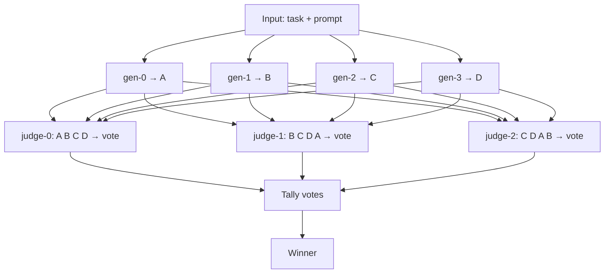

# candidate-judge

> Extracted from [MiaoHelper](https://github.com/ason6565-ai/MiaoHelper) (拟言助手).

Multi-candidate generation + AI judge voting for any LLM task.
多候选生成 + AI裁判投票，适用于任何大模型任务。

## English

Existing LLM libraries solve "call one model, get one result". This library solves: call multiple times, get multiple candidates, then have AI judges vote on the best one.

Works for: translation, writing, code generation, prompt engineering — any task where one answer isn't good enough.

**Pure Java 8+, zero dependencies.** Android, server JVM, desktop. Kotlin compatible.

### Install

Copy `src/main/java/candidate/judge/` into your project source root, keep the package path `candidate.judge`. No build tool required.

### Quick start

```java
// 1. Implement LlmCaller (wire to your HTTP client of choice)
LlmCaller gen = (systemPrompt, userPrompt) -> {
    String output = yourHttpClient.call(systemPrompt, userPrompt);
    return new LlmCaller.Result(output, 150, 80);
};

// 2. Generate 4 candidates from the same model
List<LlmCaller.Candidate> cands =
    CandidateJudge.generate(gen, "Rewrite naturally", "Hello world", 4);

// 3. 3 judges vote on the best one
CandidateJudge.Report rep = CandidateJudge.vote(gen, cands, 3);

// 4. Done
System.out.println(rep.winner.text);
```

### Multi-model

Each candidate can come from a different model. Each judge can be a different model:

```java
List<LlmCaller.Candidate> cands = CandidateJudge.generateMulti(
    List.of(gpt4oCall, claudeCall, geminiCall, deepseekCall),
    "Translate to English", "你好世界");

CandidateJudge.Report rep = CandidateJudge.voteMulti(
    List.of(gpt4oCall, deepseekCall, qwenCall), cands);
```

### How it works



**Position rotation.** Each judge sees candidates in a shifted order. Without this, judges have a bias toward the first or last option regardless of quality. Rotation spreads that bias evenly.

**Abstention.** If a judge's response can't be parsed as a valid candidate number, it counts as an abstention rather than a forced wrong vote. If all judges abstain, the first candidate is returned as a safe fallback.

**Why 3+3?** Each additional generator or judge costs API calls. Going from 1+1 to 3+3 yields most of the quality improvement; beyond that, gains are marginal. 3+3 is the cost/quality sweet spot for most production use cases.

## Testing

```bash
# compile core + examples
javac -cp src/main/java examples/TestAll.java

# run (Windows)
java -cp src/main/java;examples TestAll
# run (Linux/Mac)
java -cp src/main/java:examples TestAll
```

Covers: single candidate, basic vote, all-abstain fallback, multi-model judges, position rotation, empty list.

## 中文

现有 LLM 库只解决"调一个模型拿一个结果"。这个库解决：多次调用拿多个候选，再用 AI 投票选最好的那个。

适用于翻译、写作、代码生成、提示词工程。

**纯 Java 8+，零依赖。** Android、服务端、桌面都能跑。

### 安装

把 `src/main/java/candidate/judge/` 拷进项目源码目录，包名不变。

## License

0BSD — do whatever you want, no attribution required.
